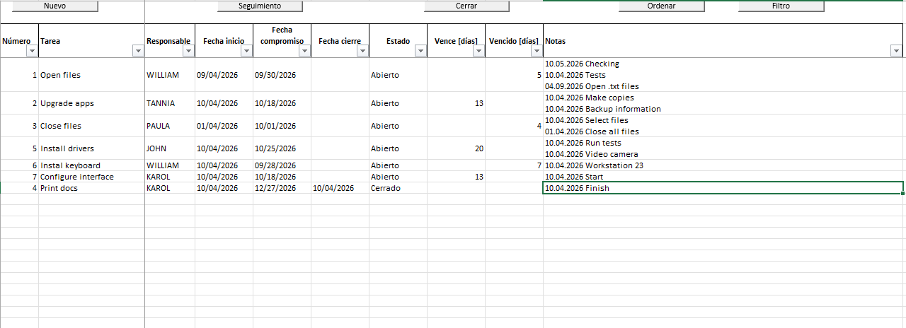
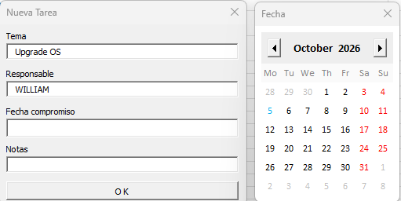

# Excel VBA Task Tracker

Tracks tasks, follow-ups and closures in Excel using VBA forms. Built to replace manual task lists with a form-driven workbook that keeps open items sorted and every follow-up dated.

## What it does

- Adds new tasks through a form
- Records follow-up notes with date stamps
- Closes tasks and re-sorts open items first
- Picks dates from a built-in calendar form

## Tools

Excel, VBA (UserForms), structured sorting and filtering

## Files

- `DATE PICKER.xlsm`: the workbook
- `vba/`: exported VBA modules (`.bas`) and forms (`.frm`, `.frx`)
- `images/`: screenshots

## How to try it

Download the workbook, enable macros and use the buttons on the main sheet. Requires Excel for Windows.
